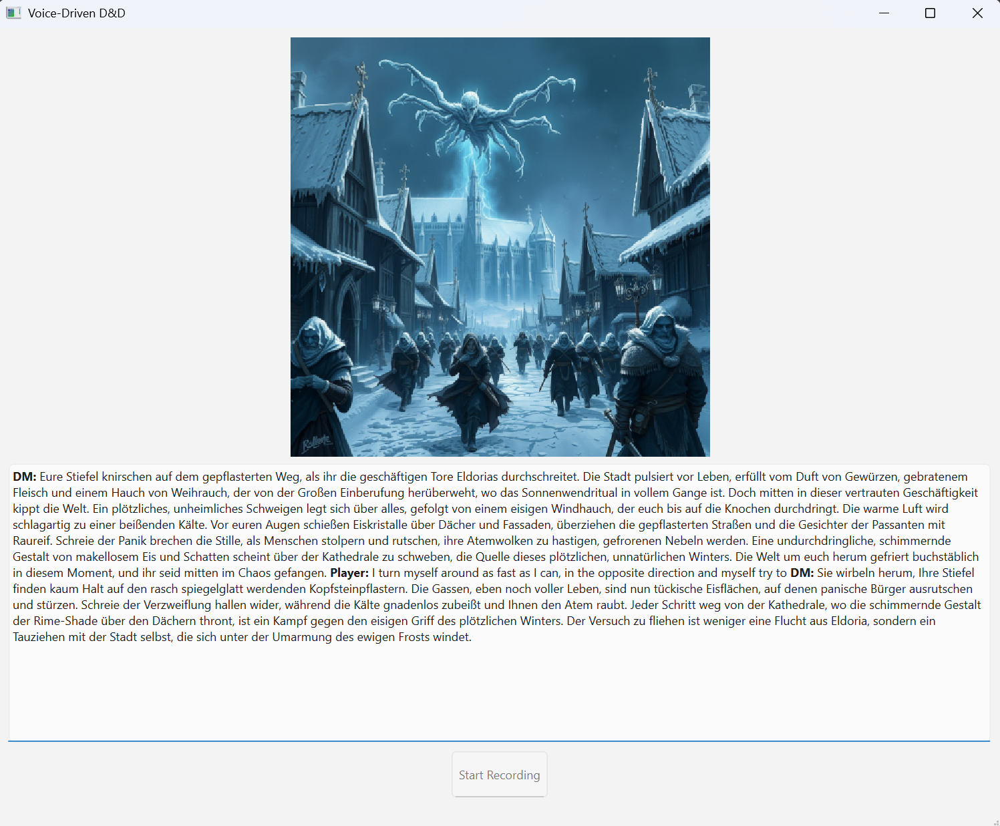

# 🎲 Voice-Driven D&D Game Master

An AI-powered Dungeon Master that brings your D&D campaigns to life with voice interaction, dynamic image generation, and intelligent memory management. Speak your actions, listen to the DM's responses, and watch your adventure unfold visually in real-time.



## ✨ Features

### 🎙️ **Voice-First Experience**

- **Speech-to-Text**: Speak your actions naturally using OpenAI Whisper
- **Dynamic Text-to-Speech**: AI-generated voices for the DM and NPCs with personality-matched voice selection
- **Real-time Processing**: Seamless voice interaction without typing

### 🖼️ **Visual Storytelling**

- **Scene Generation**: Automatic image creation for every scene using AI image generation
- **Character Portraits**: Visual representations of NPCs you encounter
- **Consistent Art Style**: Maintains visual coherence throughout your campaign

### 🧠 **Intelligent Campaign Management**

- **Interactive Campaign Planner**: Collaborative campaign creation through guided questions
- **Smart Memory System**: Automatic compression of long conversation histories at natural story breaks
- **Dynamic NPCs**: Rich character interactions with unique voices and personalities
- **Story Continuity**: Maintains context across multiple sessions

### 🌍 **Multi-Language Support**

- Configurable language settings for international players
- Automatic translation support via Google Translate

### 🎭 **Rich NPC Interactions**

- **Character-Specific Voices**: Each NPC gets a unique voice personality
- **Deep Conversations**: Extended dialogue systems with natural conversation flow
- **Visual Portraits**: Generated character art for immersive interactions

## 🚀 Quick Start

### Prerequisites

- Python 3.10+
- Microphone and speakers/headphones
- API Keys (see Configuration section)

### Installation

1. **Clone the repository**

   ```bash
   git clone https://github.com/bertilbraun/agentic-llm-dnd-gm.git
   cd agentic-llm-dnd-gm
   ```

2. **Install dependencies**

   ```bash
   pip install -r requirements.txt
   ```

3. **Configure API keys**

   ```bash
   cp src/config.example.py src/config.py
   # Edit config.py with your API keys
   ```

4. **Run the application**

   ```bash
   cd src
   python main.py        # GUI version (recommended)
   python main.py --cli  # Command-line version
   ```

## ⚙️ Configuration

Copy `src/config.example.py` to `src/config.py` and fill in your API keys:

```python
# Required API Keys
GEMINI_API_KEY = 'your-gemini-api-key-here' # For the LLM
RUNWARE_API_KEY = 'your-runware-api-key-here' # For the image generation
OPENAI_API_KEY = 'your-openai-api-key-here' # For the text-to-speech

# Model Configuration
MODEL = 'gemini-2.5-flash'  # AI model for DM responses

# Language Settings
LANGUAGE = 'en'  # 'en', 'de', 'fr', 'es', etc.
```

### Required Services

- **Google Gemini**: For AI Dungeon Master responses
- **Runware**: For scene and character image generation
- **OpenAI**: For speech-to-text (Whisper) and text-to-speech

## 🎮 How to Play

### 1. **Campaign Creation**

- First run creates an interactive campaign planner
- Answer questions about your preferred theme, tone, and story elements
- The AI generates a complete campaign structure with acts and visual style

### 2. **Voice Interaction**

- Click "Start Recording" to speak your actions
- Click "Stop Recording" when finished
- Listen to the DM's response and watch the scene unfold

### 3. **NPC Conversations**

- When you encounter NPCs, special conversation mode activates
- Each NPC has a unique voice and personality
- Conversations flow naturally until reaching a conclusion

### 4. **Visual Experience**

- Every scene generates a new image automatically
- Images maintain consistent art style throughout the campaign
- Character portraits appear during NPC interactions

## 🏗️ Architecture

### Core Components

- **`main.py`**: Main game loop and campaign management
- **`llm.py`**: AI model integration (Gemini) with translation support
- **`stt.py`**: Speech-to-text using OpenAI Whisper
- **`tts.py`**: Text-to-speech with multiple voice personalities
- **`image.py`**: AI image generation via Runware
- **`memory.py`**: Intelligent conversation history management
- **`qt.py`**: PyQt6 GUI interface

### Data Flow

```
Voice Input → STT → AI DM → TTS + Image Generation → GUI Update
                ↓
            Memory System (Auto-compression at story breaks)
```

## 🧩 Advanced Features

### Memory Management

- **Automatic Compression**: Detects natural story breaks and compresses history
- **Context Preservation**: Maintains important information while reducing token usage
- **Long-term Continuity**: Supports extended campaigns across multiple sessions

### Multi-Modal AI

- **Structured Responses**: Uses Pydantic models for consistent AI outputs
- **Dynamic Prompting**: Context-aware prompts based on campaign state
- **Visual Consistency**: Maintains art style across all generated images

### Extensible Design

- **Modular TTS**: Support for multiple TTS engines (Coqui, OpenAI)
- **Plugin Architecture**: Easy to add new AI models or services
- **Configurable Voices**: Extensive voice personality system

## 🛠️ Development

### Project Structure

```
└── BertilBraun/Agentic-LLM-DnD-GM
    ├── requirements.txt
    └── src/
        ├── config.example.py
        ├── image.py          # Image generation
        ├── llm.py           # AI model integration
        ├── main.py          # Main game loop
        ├── memory.py        # Memory management
        ├── qt.py           # GUI interface
        ├── stt.py          # Speech-to-text
        └── tts.py          # Text-to-speech
```

### Adding New Features

The codebase is designed for extensibility:

- **New TTS Engines**: Implement `BaseTTS` interface in `tts.py`
- **Additional AI Models**: Extend the client setup in `llm.py`
- **Custom Memory Systems**: Implement new compression strategies in `memory.py`

## 🎯 Use Cases

- **Solo D&D Sessions**: Perfect for single-player adventures
- **DM Assistance**: Helps human DMs with NPC voices and scene visualization
- **Story Prototyping**: Test campaign ideas with AI feedback
- **Accessibility**: Voice-first interface for players with typing difficulties
- **Language Learning**: Practice RPG vocabulary in different languages

## 🔧 Troubleshooting

### Common Issues

**Audio Problems**

- Ensure microphone permissions are granted
- Check default audio device settings
- Test with `--cli` mode first

**API Key Issues**

- Verify all API keys are correctly configured
- Check API service status and quotas
- Ensure config.py exists (not config.example.py)

**Performance Issues**

- Close other audio applications
- Use smaller Whisper model ('base' instead of 'large')
- Check available GPU memory for image generation

## 📋 Roadmap

### Current Features ✅

- [x] Voice input/output system
- [x] AI image generation for scenes
- [x] Intelligent memory compression
- [x] Multi-language support
- [x] Rich NPC interaction system
- [x] GUI interface

### Planned Features 🔮

- [ ] Multiple player support
- [ ] Different input methods per player
- [ ] Campaign sharing and export
- [ ] Custom voice training
- [ ] Integration with D&D Beyond
- [ ] Mobile app version

## 🤝 Contributing

Contributions are welcome! Please feel free to submit pull requests or open issues for:

- Bug fixes and performance improvements
- New TTS/STT engine integrations
- Additional language support
- UI/UX enhancements
- Documentation improvements

## 📄 License

This project is open source. Please check the license file for details.

## 🙏 Acknowledgments

- **OpenAI** for Whisper STT and GPT-based TTS
- **Google** for Gemini AI models
- **Runware** for AI image generation
- **Coqui TTS** for open-source text-to-speech
- **PyQt6** for the GUI framework

---

*Ready to embark on your AI-powered D&D adventure? Set up your API keys and let the magic begin!* 🧙‍♂️✨
