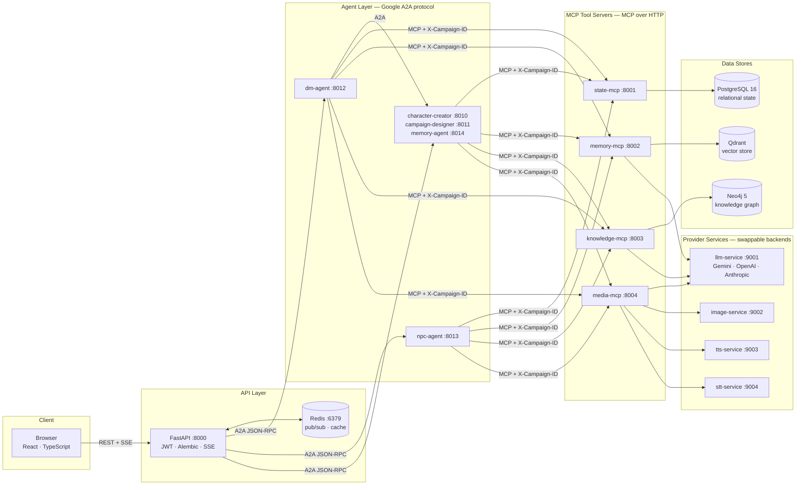
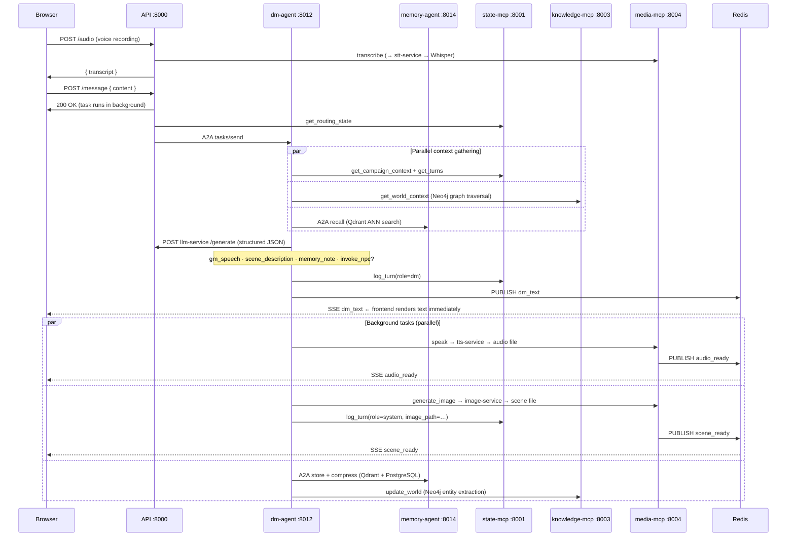

# Agentic LLM Orchestration System

A production-grade multi-agent AI platform demonstrating practical application of knowledge graphs, vector databases, multi-agent orchestration via standardised protocols (A2A, MCP), and full-stack observability for LLM-based systems.

> The system is deployed as an interactive AI story narrator for tabletop-style roleplay — see [documentation/PRODUCT.md](documentation/PRODUCT.md) for the product context. This document covers the engineering.

---

## Architecture

The system is decomposed into four distinct layers communicating over well-defined protocols. No layer has direct knowledge of another layer's internals.


```mermaid
graph LR
    subgraph Client
        B["Browser\nReact · TypeScript"]
    end

    subgraph api ["API Layer"]
        A["FastAPI :8000\nJWT · Alembic · SSE"]
        R[("Redis :6379\npub/sub · cache")]
        A <--> R
    end

    subgraph agents ["Agent Layer — Google A2A protocol"]
        D["dm-agent :8012"]
        N["npc-agent :8013"]
        O["character-creator :8010\ncampaign-designer :8011\nmemory-agent :8014"]
    end

    subgraph mcp ["MCP Tool Servers — MCP over HTTP"]
        SM["state-mcp :8001"]
        MM["memory-mcp :8002"]
        KM["knowledge-mcp :8003"]
        MD["media-mcp :8004"]
    end

    subgraph stores ["Data Stores"]
        PG[("PostgreSQL 16\nrelational state")]
        QD[("Qdrant\nvector store")]
        N4[("Neo4j 5\nknowledge graph")]
    end

    subgraph providers ["Provider Services — swappable backends"]
        LS["llm-service :9001\nGemini · OpenAI · Anthropic"]
        IS["image-service :9002"]
        TS["tts-service :9003"]
        SS["stt-service :9004"]
    end

    B -->|"REST + SSE"| A
    A -->|"A2A JSON-RPC"| D & N & O
    D -->|"A2A"| O
    D & N & O -->|"MCP + X-Campaign-ID"| SM & MM & KM & MD
    SM --> PG
    MM --> QD
    KM --> N4
    KM & MM --> LS
    MD --> LS & IS & TS & SS
```

---

## Key Engineering Decisions

### Multi-Agent Architecture via Google A2A

Five independent FastAPI services implement the [Google Agent-to-Agent (A2A) protocol](https://google.github.io/A2A/) — JSON-RPC 2.0 over HTTP with a `/.well-known/agent.json` discovery endpoint. The `api` service reads campaign routing state from the database and dispatches each player message to exactly one agent; no business logic lives in the API layer itself.

| Agent | Port | Responsibility |
| --- | --- | --- |
| `character-creator` | 8010 | Guided character creation wizard |
| `campaign-designer` | 8011 | Campaign plan generation, world graph seeding |
| `dm-agent` | 8012 | Core gameplay: narration, scene images, NPC invocation |
| `npc-agent` | 8013 | Extended NPC dialogue; returns summary to DM on close |
| `memory-agent` | 8014 | Semantic recall + hierarchical memory summarisation |

The DM agent invokes the memory agent over A2A mid-turn (not via MCP), keeping memory intelligence encapsulated and independently deployable.

### MCP Tool Servers

Agents interact with shared infrastructure through four [Model Context Protocol (MCP)](https://modelcontextprotocol.io/) HTTP tool servers. A `CampaignIDMiddleware` on every MCP server reads the `X-Campaign-ID` request header and makes it available as `request.state.campaign_id` — tool handlers never receive it as a body parameter. This means campaign isolation is enforced at the transport layer, not scattered through business logic.

| MCP Server | Port | Backing Store | Tools |
| --- | --- | --- | --- |
| `state-mcp` | 8001 | PostgreSQL | Campaign/character/NPC CRUD, turn log, routing state |
| `memory-mcp` | 8002 | Qdrant | Semantic store/recall using 1536-dim Gemini embeddings |
| `knowledge-mcp` | 8003 | Neo4j | Entity/relationship extraction, world context retrieval |
| `media-mcp` | 8004 | Shared volume + provider services | TTS, STT, image generation, file I/O |

### Knowledge Graph (Neo4j)

`knowledge-mcp` extracts named entities (NPCs, locations, factions, items) and their typed relationships from narrative text via a structured LLM call after every DM turn, then writes them to Neo4j using `MERGE` (idempotent upserts). Before each DM response, `get_world_context` performs a full-text search against node names and descriptions, then returns matching nodes with their 1-hop relationships as a compact context string. This grounds the LLM in established facts without unbounded prompt growth, and prevents the model from contradicting earlier world state as campaigns extend.

Node labels: `NPC`, `Location`, `Faction`, `Item`, `Event`. All carry a `campaign_id` property; every Cypher query filters by it first.

### Vector Database (Qdrant)

`memory-mcp` stores narrative events as 1536-dimensional vectors using the `gemini-embedding-2` model (same API key as the LLM, no local model needed). The `memory-agent` runs two operations each turn:

1. **Recall** — embeds the current player query, runs a campaign-scoped ANN search, returns the top-8 semantically relevant past events
2. **Compression** — when the short-term event list reaches a threshold, an LLM call decides whether a narrative break has occurred; if so, short-term memory is summarised into the long-term baseline, keeping only the last three events in the rolling list

This gives every DM prompt both semantic depth (Qdrant recall) and temporal recency (short-term list + long-term summary) without unbounded token growth.

### Provider Services (Swappable Backends)

Four thin adapter services wrap external AI APIs behind a uniform FastAPI contract. Switching providers requires only changing an env var (`LLM_PROVIDER=anthropic`, `TTS_PROVIDER=gemini`, etc.) — no agent code changes. Each service additionally provides:

- **Redis caching** — identical requests return cached responses (24 h TTL for audio, 1 h for text/images)
- **Usage logging** — token counts written to PostgreSQL `llm_usage` for cost accounting
- **Langfuse tracing** — per-generation input/output/token tracking (llm-service only, optional)

### Real-Time Event Delivery (SSE over Redis pub/sub)

The `api` dispatches agent tasks as a fire-and-forget `asyncio.create_task` and immediately returns `200 OK`. Agents publish typed SSE events (`dm_text`, `audio_ready`, `scene_ready`, `npc_introduced`, …) directly to a Redis channel keyed by `campaign_id`. The browser holds an `EventSource` connection that relays from that channel. This decouples agent execution time from HTTP response latency and lets the UI stream partial results — text first, then audio, then image — as each becomes available.

A per-campaign Redis lock prevents concurrent turns from racing.

---

## Service Map

| Service | Stack | Purpose |
| --- | --- | --- |
| `api` | FastAPI, SQLAlchemy, Alembic | Auth, campaign CRUD, SSE stream, A2A dispatch |
| `dm-agent` | FastAPI, httpx | Core DM logic, scene generation orchestration |
| `npc-agent` | FastAPI, httpx | NPC dialogue loop |
| `character-creator` | FastAPI, httpx | Character creation wizard |
| `campaign-designer` | FastAPI, httpx | Campaign plan + world seed |
| `memory-agent` | FastAPI, httpx | Semantic recall + memory summarisation |
| `state-mcp` | FastAPI, SQLAlchemy | PostgreSQL state tool server |
| `memory-mcp` | FastAPI, Qdrant client | Vector memory tool server |
| `knowledge-mcp` | FastAPI, Neo4j driver | Knowledge graph tool server |
| `media-mcp` | FastAPI, httpx | Media orchestration tool server |
| `llm-service` | FastAPI | LLM adapter (Gemini / OpenAI / Anthropic) |
| `image-service` | FastAPI | Image adapter (Gemini / Runware / DALL-E) |
| `tts-service` | FastAPI | TTS adapter (OpenAI / Gemini / ElevenLabs) |
| `stt-service` | FastAPI | STT adapter (Whisper local / OpenAI) |
| `frontend` | React 18, TypeScript, Vite | SPA served by nginx |
| `postgres` | PostgreSQL 16 | Relational state, turn history, usage stats |
| `qdrant` | Qdrant 1.9 | Semantic memory vectors |
| `neo4j` | Neo4j 5 Community | World knowledge graph |
| `redis` | Redis 7 | SSE pub/sub + LLM/TTS response cache |

Every service has a Docker Compose health check. Dependent services only start after their dependencies are healthy.

---

## Observability

All services run under `opentelemetry-instrument` with OTLP export to Tempo. Prometheus scrapes a metrics endpoint (port 9464) on every service. Logs are forwarded via Promtail to Loki. All three signals are queryable in a single Grafana instance.

| Tool | Port | Coverage |
| --- | --- | --- |
| **Grafana** | 3002 | Unified dashboards — traces (Tempo), metrics (Prometheus), logs (Loki) |
| **Tempo** | 3200 | Distributed traces — full span tree: browser → API → agent → MCP → provider service |
| **Prometheus** | 9090 | RED metrics per service; Tempo-generated service graph |
| **Loki + Promtail** | 3100 | Structured log aggregation from all Docker containers |
| **Langfuse** | 3001 | LLM-specific traces — input/output/token counts per generation (optional) |

---

## Data Flow: A Single Turn


```mermaid
sequenceDiagram
    participant B as Browser
    participant A as API :8000
    participant D as dm-agent :8012
    participant Mem as memory-agent :8014
    participant S as state-mcp :8001
    participant K as knowledge-mcp :8003
    participant Med as media-mcp :8004
    participant R as Redis

    B->>A: POST /audio (voice recording)
    A->>Med: transcribe (→ stt-service → Whisper)
    A->>B: { transcript }
    B->>A: POST /message { content }
    A->>B: 200 OK  (task runs in background)
    A->>S: get_routing_state
    A->>D: A2A tasks/send

    par Parallel context gathering
        D->>S: get_campaign_context + get_turns
    and
        D->>K: get_world_context (Neo4j graph traversal)
    and
        D->>Mem: A2A recall (Qdrant ANN search)
    end

    D->>A: POST llm-service /generate (structured JSON)
    Note over D: gm_speech · scene_description · memory_note · invoke_npc?

    D->>S: log_turn(role=dm)
    D->>R: PUBLISH dm_text
    R-->>B: SSE dm_text  ← frontend renders text immediately

    par Background tasks (parallel)
        D->>Med: speak → tts-service → audio file
        Med->>R: PUBLISH audio_ready
        R-->>B: SSE audio_ready
    and
        D->>Med: generate_image → image-service → scene file
        D->>S: log_turn(role=system, image_path=…)
        Med->>R: PUBLISH scene_ready
        R-->>B: SSE scene_ready
    and
        D->>Mem: A2A store + compress (Qdrant + PostgreSQL)
        D->>K: update_world (Neo4j entity extraction)
    end
```

---

## Tech Stack Summary

| Concern | Technology | Why |
| --- | --- | --- |
| Agent communication | Google A2A (JSON-RPC 2.0) | Standard protocol; enforces service boundaries; discovery via agent card |
| Tool calling | MCP over HTTP | Standardised tool interface; campaign scope injected at transport layer |
| LLM inference | Gemini 2.5 Flash (default) | Structured output, low cost; swappable to Anthropic/OpenAI via env var |
| Embeddings | Gemini `gemini-embedding-2` (1536-dim) | Same API key; no local model to maintain |
| Vector store | Qdrant | Campaign-scoped ANN search; persistent payload storage |
| Knowledge graph | Neo4j 5 + Cypher | Typed entity/relationship model; full-text + graph traversal for context retrieval |
| Relational DB | PostgreSQL 16 + Alembic | Campaign state, turn history, usage accounting; versioned schema migrations |
| Cache / pub-sub | Redis 7 | LLM/TTS response caching; SSE fan-out decoupled from agent execution |
| API framework | FastAPI + Pydantic v2 | Async-native; typed end-to-end; automatic OpenAPI docs |
| Frontend | React 18, TypeScript, Vite, Zustand | SSE + Web Audio API; typed API client |
| Containerisation | Docker Compose | 22-service stack; health-checked startup ordering |
| Distributed tracing | OpenTelemetry → Grafana Tempo | Full request trace across all service boundaries |
| Metrics | Prometheus + Grafana | RED metrics per service; Tempo service graph |
| Log aggregation | Loki + Promtail | Structured logs from all containers in one place |
| LLM observability | Langfuse 3 (optional) | Per-generation input/output/token tracking |
| Auth | JWT HS256, httpOnly cookie | Stateless; cookie enables SSE + media auth without JS token management |

---

## Setup

See [documentation/SETUP.md](documentation/SETUP.md) for the full guide. The short version:

```bash
cp .env.example .env          # fill in at least one LLM provider key
docker compose up -d          # builds and starts all 22 services (~5 min first run)
```

| URL | Service |
| --- | --- |
| <http://localhost:3000> | Frontend |
| <http://localhost:8000/docs> | API (OpenAPI) |
| <http://localhost:3002> | Grafana |

Optional Langfuse LLM tracing — run the separate stack in [observability/](observability/) and add the resulting API keys to `.env`.
