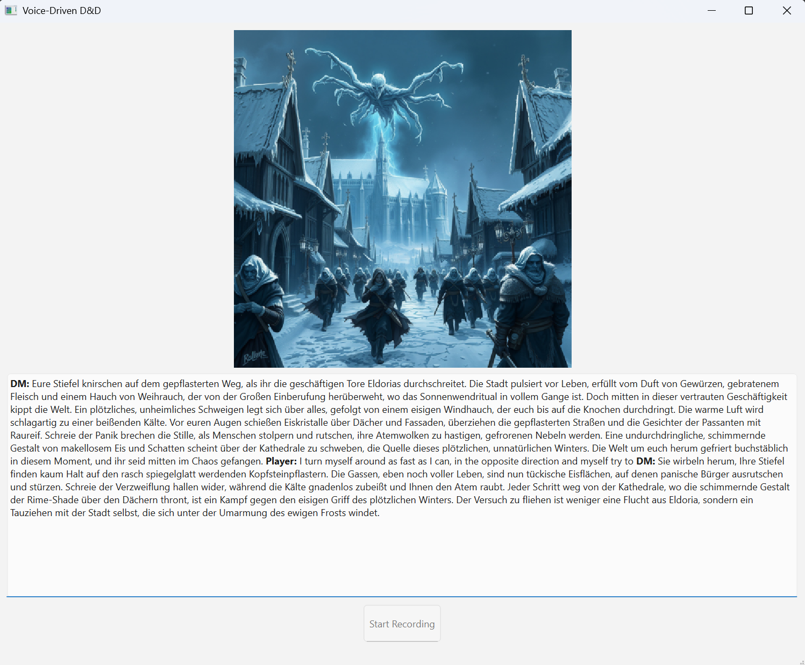

# Voice-Driven AI Story Narrator — Product Overview

An AI-powered story narrator that brings tabletop roleplay campaigns to life with voice interaction, dynamic image generation, and intelligent memory management. Speak your actions, listen to the narrator's responses, and watch your adventure unfold visually in real-time.

## Features

### Voice-First Experience

- **Speech-to-Text**: Speak your actions naturally using OpenAI Whisper (or Gemini Audio)
- **Dynamic Text-to-Speech**: AI-generated voices for the DM and each NPC with personality-matched voice selection and instructions
- **Real-time Processing**: Seamless voice interaction without typing

### Visual Storytelling

- **Scene Generation**: Automatic image creation for every DM narration using AI image generation
- **Character Portraits**: Visual representations of NPCs you encounter
- **Consistent Art Style**: Each campaign defines a visual style maintained across all generated imagery

### Intelligent Campaign Management

- **Interactive Campaign Planner**: Collaborative campaign creation through a guided setup wizard
- **Smart Memory System**: Semantic retrieval (Qdrant) combined with hierarchical summarisation for long-term continuity
- **Dynamic NPCs**: Rich character interactions with unique voices, personalities, and per-campaign knowledge
- **Story Continuity**: Campaign state, turns, and world knowledge persist across sessions

### Rich NPC Interactions

- **Character-Specific Voices**: Each NPC gets a unique voice and personality-matched voice instructions
- **Deep Conversations**: Extended dialogue systems with the NPC agent; DM resumes after conversation ends
- **Visual Portraits**: Generated character art for immersive interactions

## How to Play

### 1. Campaign Creation

- The setup wizard walks you through character creation and campaign design
- Answer questions about your preferred theme, tone, and story elements
- The AI generates a complete campaign structure with acts and a visual style

### 2. Voice Interaction

- Click the microphone to speak your actions
- Listen to the DM's response and watch the scene image update
- Type instead of speaking if you prefer

### 3. NPC Conversations

- When you encounter an NPC, a dedicated NPC agent takes over the conversation
- Each NPC has a unique voice and personality
- Conversations flow naturally until reaching a conclusion; the DM then resumes

### 4. Visual Experience

- Every DM turn generates a new scene image automatically
- NPC introductions generate character portraits
- Images persist across page reloads and sessions

## Setup

See [SETUP.md](../SETUP.md) for full installation and configuration instructions.
